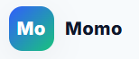
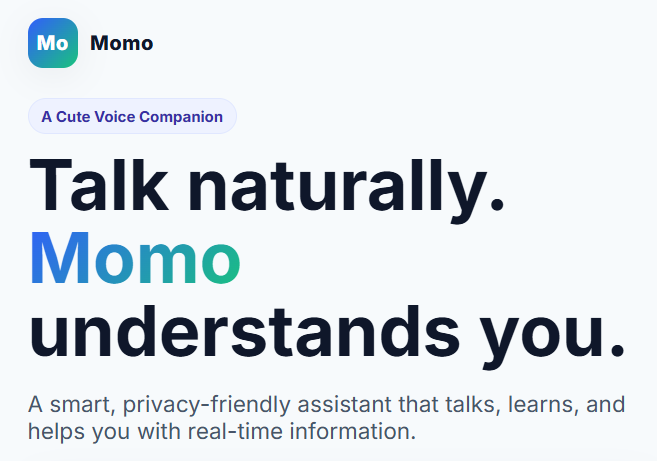
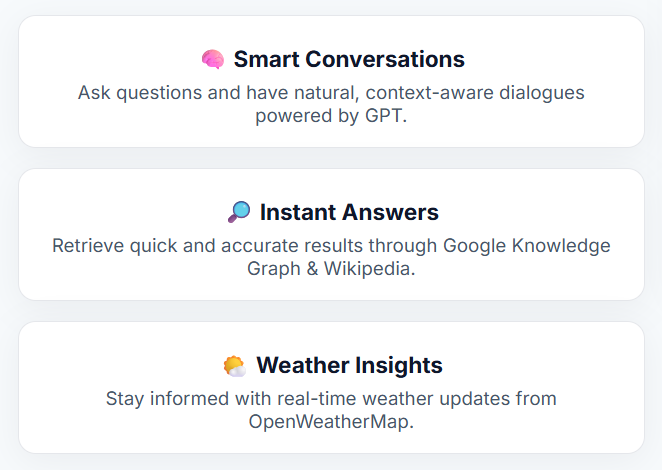
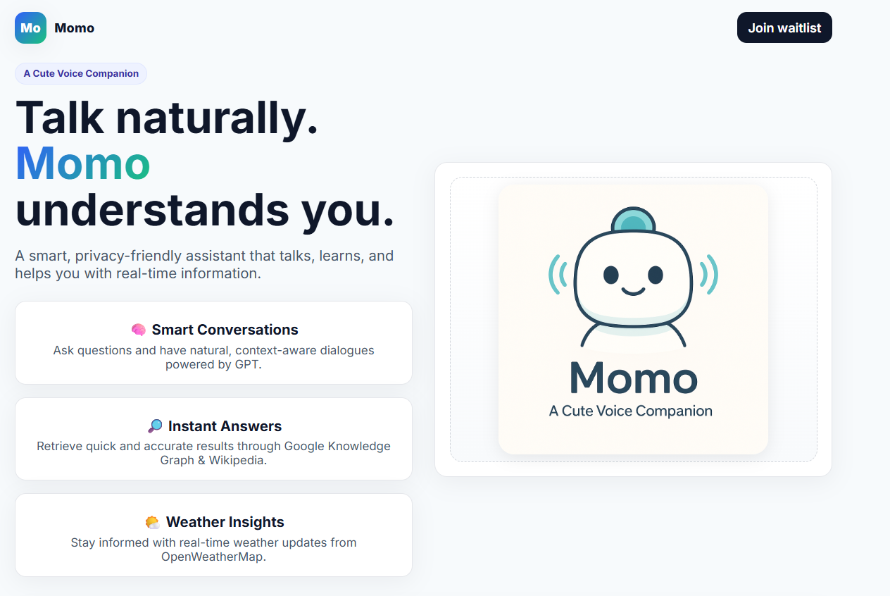
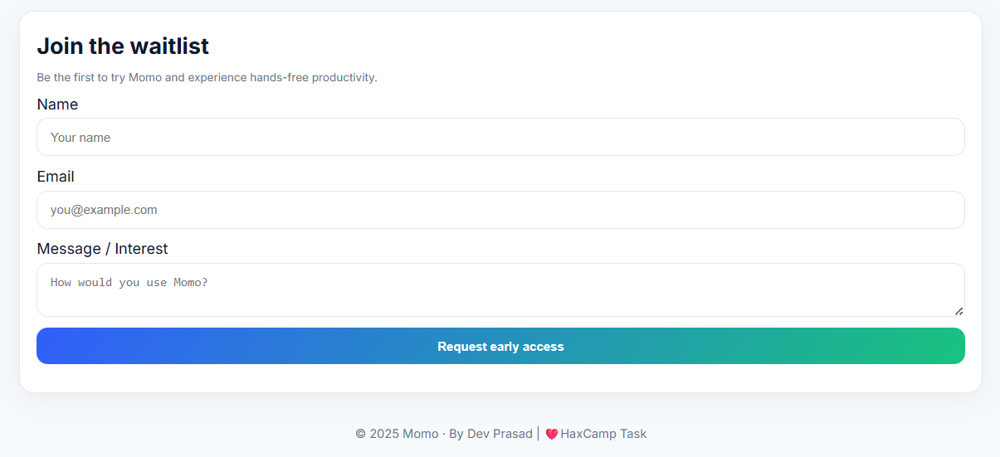

# 🌟 Momo — Voice Assistant Landing Page



**Momo** is a friendly, privacy-conscious **AI voice companion** that helps users interact naturally through speech — whether it's answering questions, fetching real-time information, or providing weather insights.

This project was built as part of the **HaxCamp Developer Internship Assignment** — *“Launch a Product: Build a Landing Page + Waitlist with Supabase.”*  
It demonstrates front-end design, Supabase integration, and the creative use of AI-assisted tools in development.

---

## 🖥️ Project Overview

Momo’s landing page is a **clean, modern, light-mode website** that introduces the product concept, highlights its features, and includes a functional **waitlist form** backed by Supabase for storing early-access sign-ups.

---

## ✨ Features

| Feature | Description |
|----------|-------------|
| 🧠 **Smart Conversations** | Have context-aware, natural dialogues powered by GPT. |
| 🔎 **Instant Answers** | Retrieve quick and accurate information using Google Knowledge Graph and Wikipedia. |
| 🌤️ **Weather Insights** | Get real-time weather updates from OpenWeatherMap. |

---

## 🧰 Tech Stack

- **Frontend:** HTML, CSS, JavaScript  
- **Backend / Database:** [Supabase](https://supabase.com)  
- **AI Tools Used:** ChatGPT & DALL·E (for design and branding)  
- **Hosting Options:** Netlify / GitHub Pages / Vercel  

---

## 🧠 AI-Generated Branding

The project includes an original AI-generated mascot that represents Momo — a cute, minimalist assistant designed in a soft blue-green palette to reflect approachability and intelligence.


---

## 📸 Website Screenshots

### 1️⃣ Hero Section


### 2️⃣ Features Section


### 3️⃣ Complete Layout


### 4️⃣ Supabase Integration


---

## ⚙️ Supabase Setup Guide

1. Create a Supabase project at [https://supabase.com](https://supabase.com).  
2. In your project, create a table named **`waitlist`** with the following columns:

| Column | Type | Notes |
|---------|------|--------|
| id | bigint | Primary Key (identity) |
| name | text | — |
| email | text | — |
| message | text | Optional |

3. Enable **Row Level Security (RLS)** and add a permissive insert policy for `anon` users:

```sql
alter table public.waitlist enable row level security;
create policy "allow anon inserts" on public.waitlist for insert to anon with check (true);
```

4. Replace your Supabase credentials in `index.html`:

```js
const SUPABASE_URL = "https://your-project-url.supabase.co";
const SUPABASE_ANON_KEY = "your-anon-key";
```

---

## 🚀 How to Run Locally

1. Download or clone the repository.  
2. Open `index.html` in your browser.  
3. Test the **waitlist form** — your entries will appear in Supabase.  

To deploy online:  
- Upload to **GitHub Pages** (Settings → Pages → Deploy)  
- Or drag the folder to [Netlify Drop](https://app.netlify.com/drop)

---

## 💡 Learnings and Takeaways

- Leveraged **Supabase** for real-time backend integration without traditional APIs.  
- Explored **AI-assisted development** using ChatGPT and DALL·E for UI + branding.  
- Understood modern landing-page UX: simplicity, clarity, and strong CTAs.  
- Improved version control and deployment workflow using GitHub and Netlify.

---

## 👨‍💻 Developer

**Dev Prasad**  
📧 [mr.devprasad2004@gmail.com](mailto:mr.devprasad2004@gmail.com)  
💼 [LinkedIn](www.linkedin.com/in/prasad-dev) (add your actual link)  

---

## 🏁 Acknowledgements

Special thanks to **HaxSecurity & HaxCamp Team** for the opportunity to work on this creative developer assignment and explore AI-assisted coding workflows.

---

© 2025 **Momo Voice Assistant** | Designed & Developed by **Dev Prasad**
